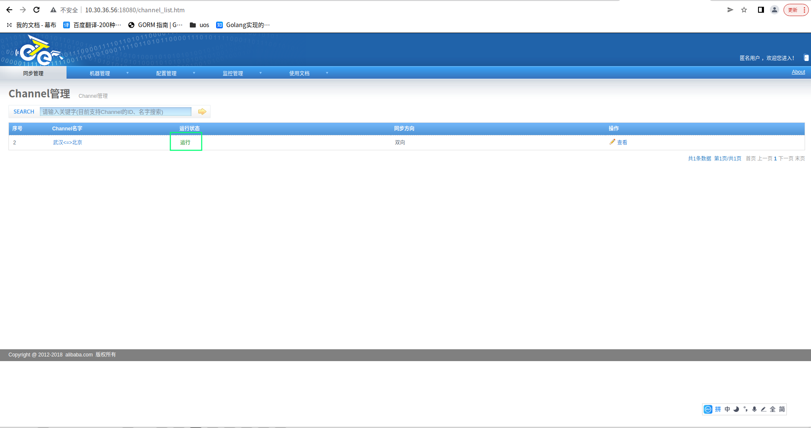

# otter异地多活配置

## 1.修改otter_conf配置
```

zk配置：
zk_cluster_address="zk-svc:2181"
zk_cluster_name="zk1"

主中心：
node节点配置
master_idc_node1="10.30.36.211"
master_idc_node2="10.30.36.212"
master_idc_node3="10.30.36.213"
master_idc_node1_external_ip="10.30.36.211"
master_idc_node2_external_ip="10.30.36.212"
master_idc_node3_external_ip="10.30.36.213"
master_idc_node1_id="212"
master_idc_node2_id="213"
master_idc_node3_id=""
canal 配置：
master_idc_mysql_master_ip="10.30.36.211"
master_idc_mysql_slave_ip1="10.30.36.212"
master_idc_mysql_slave_ip2="10.30.36.213"
master_idc_mysql_master_port="3306"
master_idc_mysql_slave_port1="3306"
master_idc_mysql_slave_port2="3306"
master_idc_mysql_dbUsername="uos"
master_idc_mysql_dbPassword="Udcp2022cs"

从中心：
node节点配置
slave_idc_node1="10.20.15.211"
slave_idc_node2="10.20.15.212"
slave_idc_node3="10.20.15.213"
slave_idc_node1_external_ip="10.20.15.211"
slave_idc_node2_external_ip="10.20.15.212"
slave_idc_node3_external_ip="10.20.15.213"
slave_idc_node1_id="214"
slave_idc_node2_id="215"
slave_idc_node3_id=""

canal 配置：
slave_idc_mysql_master_ip="10.20.15.211"
slave_idc_mysql_slave_ip1="10.20.15.212"
slave_idc_mysql_slave_ip2="10.20.15.213"
slave_idc_mysql_master_port="3306"
slave_idc_mysql_slave_port1="3306"
slave_idc_mysql_slave_port2="3306"
slave_idc_mysql_dbUsername="uos"
slave_idc_mysql_dbPassword="Udcp2022cs"

```
## 2.先执行初始化otter
（需要登陆主中心的mysql主节点服务器，确认数据库连接地址）
```
cd otter_init-master
bash otter_init.bash
```
## 3.再执行初始化retl
（需要登陆主中心的mysql主节点服务器，确认数据库连接地址，执行完毕后一定要检查主中心和从中心保证都有retl数据库）
```
cd otter_init-master
bash otter_retl_init.bash
```

## 4.登陆管理后台
- 链接地址：http://ip:18080/node_list.htm
- 默认账号: admin 
- 默认密码：admin（建议初始化完成后，通过后台修改密码）
- 查看node是否启动成功
  
- 查看Pipeline是否工作中
  
- 查看Channel是否运行正常
  
## FAQ
### 初始化完成后，必做检查事项，否则会导致同步异常，报错：
- 确认主中心数据库是否存在'otter'库
- 确认双中心的每个数据库是否存在'retl'库
- 确认canal点位是否设置正常（2个canal中的配置都要检查，如果journalName和position不为空，则表示正常）
  
  
### 日志查看:
- otter后台管理页面，选择监控管理->日志记录
- otter数据库查看LOG_RECORD表
- k8s后台bash查看日志，路径为/home/admin/node
### 发现同步中断解决办法
- 先删除管理后台对应Pipeline的同步进度中点位
  
- 然后执行'bash otter_init.bash',执行后会从最新的点位开始同步，无法保证执行前的数据一致性
### 所有node节点和manager节点均启动成功，但是进入首页的时候出现该异常，报错500
- 访问http://ip:18080/system_reduction.htm
- 点击一键修复
###  检查当前集群中的主从
```
bash check_master_slave.bash
```
###  otter异常期间数据修复
```
先修改配置文件：vi sync_conf.bash
全量同步：bash sync_all.bash
区间同步：bash sync_part.bash
```